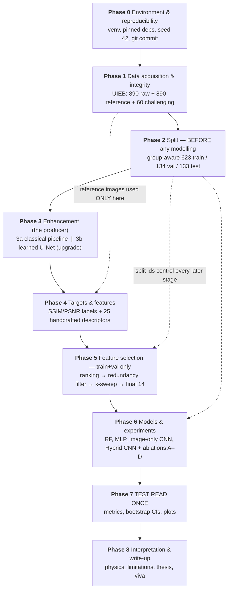

# The proper flow for this project

*Written 2026-09-16. This document is the roadmap: what the project is, the
correct order of the stages, what each stage must prove before the next one is
allowed to start, and — in §6 — the specific things that are still missing if
you want this to be a strong FYP rather than an acceptable one.*

Every number quoted here was read out of the repository's own committed result
files. Nothing is estimated or invented. Where a result does not exist yet, it
says **PENDING**.

---

## 1. First, fix what the project *is*

This is the single most important thing in this document.

Right now the project is easy to describe badly: *"I extracted 25 features from
underwater images and trained a model to predict SSIM and PSNR."* An examiner
hears that and immediately asks the obvious killer question:

> **"Why would you predict SSIM when you can just compute it? `skimage` does it
> in one line."**

If you cannot answer that, the project looks pointless. You *can* answer it, but
the answer has to be the frame that the whole thesis hangs on:

> **You can only compute SSIM if you have the reference image. In the real ocean
> you never do.**
>
> SSIM and PSNR are *full-reference* metrics — they compare an enhanced image
> against a known-perfect copy of the same scene. A diver, an AUV or a ROV
> enhancing video live has no perfect copy. So this project builds a **blind
> (no-reference) quality estimator**: it learns to *reproduce* full-reference
> scores using only information visible in the degraded/enhanced image itself.
> The UIEB reference images are used only during training, as the supervision
> signal, and are never an input.

That reframing is not spin — it is literally what the code does, and it makes
every design decision in the project logical instead of arbitrary:

| Design choice | Why it follows from the reframing |
|---|---|
| Predict SSIM **and** PSNR, not a 1–5 quality class | They are the accepted FR metrics; reproducing them blind is the goal, and keeping their units (dB) makes the error interpretable. |
| Handcrafted features *and* a CNN | Handcrafted features answer **"what physically makes an underwater image good/bad?"** — the interpretable half. The CNN answers **"is there extra signal in the pixels that the 25 numbers miss?"** — the capacity half. The hybrid asks whether the two are complementary. |
| Reference never used as an input | That is the whole point. If it were an input the task would be trivial and useless. |
| Report R²/RMSE/MAE, never "accuracy" | It is regression. Accuracy is undefined here. |

### The one-sentence version (memorise this)

> *"This project builds a no-reference image quality estimator for underwater
> images that predicts SSIM and PSNR without ever seeing the reference, and uses
> permutation-importance feature selection to show that 14 of 25 handcrafted
> descriptors carry essentially all of that signal — with red-channel attenuation,
> the dominant physical degradation underwater, emerging as the single most
> important predictor."*

That last clause is your **finding**, and it is a real one. Water absorbs red
light within roughly the first 5 metres, which is *why* underwater photographs
look blue-green. Your model was never told this. It ranked `red_ratio` **first
for both targets with a normalised importance of exactly 1.000** — nearly 3.5×
the second-ranked feature (`mean_red`, 0.288). The feature-selection stage
independently rediscovered the physics. That is what a viva is won on.

---

## 2. The flow

Nine phases. Each has a **gate**: a checkable condition that must be true before
you move on. Gates are what make a project defensible — they turn "I ran some
scripts" into "each stage was validated before the next consumed it".



ASCII fallback (same content):

```
Phase 0  Environment          venv + pinned deps + seed 42 + git commit
   |
Phase 1  Data                 UIEB 890 raw / 890 reference / 60 challenging
   |                          gate: all pairs readable, duplicates enumerated
   |
Phase 2  Split  << FIRST >>   group-aware 623 / 134 / 133, frozen forever
   |                          gate: no image id in two splits
   |
Phase 3  Enhancement          3a classical: resize → WB → CLAHE → bilateral → gamma
   |        (producer)        3b [UPGRADE] learned U-Net trained on the 623 pairs
   |                          gate: 890 outputs, gamma in [0.500, 1.412]
   |
Phase 4  Targets & features   SSIM/PSNR(enhanced, reference)  -> labels
   |        ^^^ the ONLY place the reference is ever touched ^^^
   |                          25 features from the enhanced image ONLY
   |                          gate: 27 cols x 890 rows, bit-reproducible
   |
Phase 5  Feature selection    RF permutation importance -> Pearson |r|>=0.90
   |        TRAIN + VAL ONLY   redundancy removal -> k-sweep -> final 14
   |                          gate: label-consistency assertion passes
   |
Phase 6  Models               RF(14) | MLP(14) | CNN(image) | Hybrid(image+14)
   |        TRAIN + VAL ONLY   ablations A-D, 3 seeds
   |                          gate: every hyperparameter frozen before Phase 7
   |
Phase 7  TEST — READ ONCE     R2/RMSE/MAE per target + 95% bootstrap CI + plots
   |                          gate: you do not get to go back and change Phase 5/6
   |
Phase 8  Write-up             interpretation, limitations, thesis chapters, viva
```

### The leakage firewall (learn this diagram, it is worth marks)

The thing that separates a good FYP from a mediocre one is demonstrating you
understand *which data each stage is allowed to see*. Draw this in the thesis:

| Phase | sees train (623) | sees val (134) | sees test (133) | sees **reference images** |
|---|---|---|---|---|
| 1 Data integrity | ✓ | ✓ | ✓ | ✓ (dimensions/pairing check only) |
| 2 Split | ✓ | ✓ | ✓ | ✗ (ids only) |
| 3 Enhancement | ✓ | ✓ | ✓ | ✗ |
| 4 Targets | ✓ | ✓ | ✓ | ✓ **only to compute labels** |
| 5 Selection | ✓ **fits** | ✓ **selects k** | ✗ **never** | ✗ |
| 6 Modelling | ✓ **fits** | ✓ **early stopping** | ✗ **never** | ✗ |
| 7 Evaluation | ✗ | ✗ | ✓ **once** | ✓ only to compute the true SSIM/PSNR it is compared against |

Three rules, and you should be able to state them unprompted:

1. **The reference image is a target source, never a feature.** It appears at
   Phase 4 to create the labels and at Phase 7 to create the ground truth you
   are scored against. Nowhere else.
2. **Test is read exactly once**, at Phase 7, after every choice (which
   features, which k, which architecture, which seed policy) is frozen. If a
   result disappoints you and you go back and change Phase 5, the test numbers
   are no longer test numbers — they are val numbers wearing a costume.
3. **Anything fitted, is fitted on train only.** Scalers, target standardisers,
   augmentation, early stopping. The val split may *choose* between options;
   only the test split may *report*.

Note that Phase 3 and 4 legitimately touch all 890 images. That is **not**
leakage, because per-image preprocessing fits no cross-image statistics (each
image's white balance and gamma come from that image alone) and SSIM/PSNR are
computed per pair. There is no shared parameter that could carry test
information into training.

---

## 3. Phase-by-phase: what to run, what it produces, what it must prove

### Phase 0 — Environment & reproducibility

```bash
python3 -m venv .venv && . .venv/bin/activate
pip install -r requirements.txt
git add -A && git commit -m "..."     # commit BEFORE every long run
```

* **Gate:** `import torch, cv2, sklearn, skimage, pandas` succeeds; versions
  recorded.
* **Verified versions on this machine:** torch 2.14.0+cu130 (CPU-only in
  practice), OpenCV 5.0.0, scikit-learn 1.9.1, numpy 2.4.6, pandas 3.0.5,
  scikit-image 0.26.0.
* **Why it matters:** you already proved feature extraction reproduces
  `feature_quality_dataset.csv` **bit-for-bit (max relative drift 0.0e+00)**
  across *different* library versions. That is an unusually strong
  reproducibility claim — put it in the thesis explicitly.
* **Thesis:** §3.1 / Appendix A (environment table).

### Phase 1 — Data acquisition & integrity

```bash
python scripts/download_uieb.py      # -> dataset/{raw-890,reference-890,challenging-60}
python scripts/validate_dataset.py   # -> dataset_validation_report.csv,
                                     #    duplicate_groups.csv, contact sheets
```

* **Dataset:** UIEB (Li et al., *IEEE TIP* 2020). 950 real underwater images;
  **890 have reference images**, the remaining **60 are "challenging"** and were
  excluded from paired training by the authors because no satisfactory reference
  exists. The official baseline split is 800/90 for Water-Net.
* **Critical honesty point:** the 890 references are **human-preferred
  pseudo-references** — the best output among several existing enhancement
  algorithms, chosen by volunteer pairwise voting. They are *not* physically
  captured ground truth. Your SSIM/PSNR therefore measure *agreement with a
  preferred enhancement*, not fidelity to reality. This must be in the
  Limitations chapter, stated by you before the examiner states it to you.
* **Integrity findings already in the repo:**
  * 7 groups of **byte-identical raw images** (`UIEB_111`/`UIEB_588`,
    `UIEB_479`/`UIEB_488`, `UIEB_517`/`UIEB_590`, `UIEB_627`/`UIEB_770`,
    `UIEB_645`/`UIEB_735`, `UIEB_653`/`UIEB_783`, `UIEB_665`/`UIEB_785`) — and
    4 of those pairs have *genuinely different* references. Handled by
    group-aware splitting, not by silently deleting data.
  * Raw heights range 266–901 px, **all widths are 600 px** → aspect ratio is
    not a confound (this was explicitly tested and disproved).
  * A perceptual-hash control is persisted in
    `results/feature/phash_pairing_control.csv` and **re-verified on
    2026-09-16**: correctly paired raw↔reference images have a median Hamming
    distance of **2.0** (mean 3.22, max 14), against **32.0** for deliberately
    mismatched cross-pairs (mean 31.55, 40 sampled). The pairing is therefore
    ~16× tighter than chance — direct evidence that each raw image is matched to
    the right reference, which is the assumption every label in the project
    rests on.
* **Gate:** 890/890 pairs readable, dimensions match, duplicate groups
  enumerated, contact sheets in `plots/`.
* **Thesis:** §3.2 Dataset + Table of dataset statistics.

### Phase 2 — Split, before any modelling

```bash
python scripts/make_split.py    # -> results/feature/data_split.csv
```

* **Result (verified from the committed file):** `train 623 / val 134 /
  test 133` = 70/15/15.
* **Group-aware:** duplicate images are forced into the same split, so no
  near-duplicate leaks from train into test and inflates the score.
* **Gate:** every image id appears in exactly one split (verified); split file
  is written **once** and no later script regenerates it.
* **Thesis:** §3.3. State the 70/15/15 rationale: 623 training images is small
  for a CNN, so a larger train fraction is justified; 133 test images is why
  Phase 7 needs bootstrap confidence intervals (§6, U2).

### Phase 3 — Enhancement (the producer of the images you assess)

```bash
python scripts/run_preprocessing.py   # -> dataset/preprocessed/ + preprocessing_log.csv
```

The classical chain, all in `src/preprocess.py`:

```
raw (600 px wide)
  → aspect-preserving resize to width 600, cv2.INTER_AREA
  → per-image grey-world white balance
  → CLAHE, clipLimit 2.5, tile 8×8, applied to the L channel of CIELAB
  → bilateral filter, d=9, sigmaColor=75, sigmaSpace=75
  → adaptive per-image gamma, gamma = clip(mean/128, 0.5, 2.0)
  → preprocessed image
```

* **Reproduced exactly:** heights 266–901, all widths 600, γ ∈ **[0.500,
  1.412]**, mean γ **0.865**.
* **Two ambiguities you resolved and must document** (the original notes gave
  only parameter values): CLAHE is applied to the **L channel of CIELAB** (not
  per-RGB-channel, which would shift colour), and the adaptive-gamma formula is
  `γ = clip(mean/128, 0.5, 2.0)`.
* **Gate:** 890 preprocessed images; `preprocessing_log.csv` matches.
* **Upgrade 3b — see §6, U3.** This is the weakest phase as it stands: your
  title says *enhancement*, but Phase 3 is a fixed classical chain with nothing
  learned. Adding a small U-Net trained on the same 623 pairs gives you a second
  producer, which is what makes Phase 7's generalisation test possible.
* **Thesis:** §3.4 (and §4.x if you add the U-Net).

### Phase 4 — Targets and features

```bash
python scripts/build_feature_dataset.py   # -> results/feature/feature_quality_dataset.csv
```

* **Targets:** `SSIM(enhanced, reference)` and `PSNR(enhanced, reference)`.
* **Observed label ranges (all 890):** SSIM ∈ **[0.2442, 0.9664]**, PSNR ∈
  **[9.69, 29.55] dB**. Both are wide, so there is real signal to learn — the
  labels are not concentrated in a narrow band.
* **25 handcrafted features**, in five families (`src/features.py`):

| family | features |
|---|---|
| statistical (6) | `mean`, `std`, `variance`, `entropy`, `dynamic_range`, `rms_contrast` |
| colour (7) | `mean_red`, `mean_green`, `mean_blue`, `colorfulness`, `red_ratio`, `mean_saturation`, `mean_value` |
| texture / GLCM (8) | `contrast`, `correlation`, `energy`, `homogeneity`, `ASM`, `dissimilarity`, `glcm_entropy`, `glcm_variance` |
| edge / sharpness (4) | `edge_density`, `gradient`, `laplacian_variance`, `keypoint_density` |

* **Two bugs that were fixed here, and that you should present as evidence of
  rigour** (both would have silently corrupted every feature):
  1. **uint8 overflow in `colorfulness`** — it computed `R − G` and `R + G` on
     uint8 arrays, where `10 − 200` wraps to 66 and `200 + 100` wraps to 44.
     Channels are now cast to float32 first. The *definition* is unchanged.
  2. **BGR/RGB channel order** — OpenCV reads BGR, the feature code assumed
     RGB. Without an explicit conversion, `mean_red`, `mean_blue` and
     `red_ratio` are silently swapped — which would have made your headline
     finding (red attenuation) mean the *opposite* thing. Every caller now
     converts explicitly.
* **Gate:** 27 columns × 890 rows; bit-for-bit reproducible across library
  versions.
* **Thesis:** §3.5 Targets, §3.6 Feature set. Include the five-family table.

### Phase 5 — Feature selection (train + val only)

```bash
python scripts/feature_ranking.py            # -> ranking_{ssim,psnr,combined}.csv
python scripts/feature_correlation.py        # -> correlation matrix, survivors
python scripts/feature_subset_evaluation.py  # -> k-sweep, final_selected_features.csv
```

**5a — Ranking by RF permutation importance.** A 200-tree Random Forest
(`min_samples_leaf=2`) is fit on train; importance is measured by
**permutation on held-out data** (`n_repeats=5`, scoring
`neg_mean_squared_error`) — i.e. how much the error grows when that column is
shuffled. This is the correct way to do it: impurity-based importance is biased
towards high-cardinality features.

Top 10 of `ranking_combined.csv` (normalised, committed):

| rank | feature | importance (SSIM) | importance (PSNR) | combined |
|---|---|---|---|---|
| 1 | **red_ratio** | 1.000 | 1.000 | **1.000** |
| 2 | mean_red | 0.560 | 0.015 | 0.288 |
| 3 | dynamic_range | 0.261 | 0.094 | 0.177 |
| 4 | entropy | 0.062 | 0.179 | 0.120 |
| 5 | correlation | 0.139 | 0.071 | 0.105 |
| 6 | keypoint_density | 0.143 | 0.027 | 0.085 |
| 7 | gradient | 0.120 | 0.025 | 0.072 |
| 8 | homogeneity | 0.071 | 0.048 | 0.059 |
| 9 | mean_blue | 0.053 | 0.046 | 0.050 |
| 10 | edge_density | 0.062 | 0.025 | 0.043 |

`red_ratio` is rank 1 for **both** targets independently. Note the asymmetry at
rank 2: `mean_red` matters a lot for SSIM (0.560) and almost nothing for PSNR
(0.015), whereas `entropy` is the reverse (0.062 vs 0.179) — structural
similarity is driven by colour balance, pixel error by information content.
That is a genuine, discussable observation.

**5b — Redundancy removal.** Greedy walk down the rank order; drop a feature if
`|Pearson r| ≥ 0.90` with anything already kept. **11 of 25 removed → 14
survive** (`removed_redundant_features.csv`):

| removed | kept instead | Pearson r |
|---|---|---|
| mean_red | red_ratio | 0.936 |
| gradient | keypoint_density | 0.929 |
| edge_density | keypoint_density | 0.937 |
| rms_contrast | entropy | 0.915 |
| glcm_entropy | homogeneity | −0.937 |
| mean_green | mean_blue | 0.983 |
| contrast | dissimilarity | 0.949 |
| std | entropy | 0.915 |
| colorfulness | mean_saturation | 0.967 |
| ASM | glcm_variance | **0.9999999999999998** |
| energy | glcm_variance | 0.936 |

**Also report the algebraic duplicates you found** — these are not empirical
coincidences, they are mathematical identities in the feature set:

* `std` ≡ `rms_contrast`, r = **1.0** (rms_contrast is std/mean-scaled)
* `ASM` ≡ `glcm_variance`, r = **0.9999999999999998**
* `std` ~ `variance`, r = 0.987; `variance` ~ `rms_contrast`, r = 0.987

Catching that four of your 25 descriptors are algebraically redundant is a
*quality-of-engineering* result worth a paragraph. It also means the honest
count of independent descriptors is closer to 21 than 25.

**5c — k-sweep.** Top-k subsets re-evaluated (**validation** split):

| k | SSIM R² | PSNR R² | avg R² (project-defined) |
|---|---|---|---|
| **14** | **0.5392** | **0.3674** | **0.4533** |
| 12 | 0.5220 | 0.3576 | 0.4398 |
| 10 | 0.5175 | 0.3585 | 0.4380 |
| 8 | 0.5222 | 0.3577 | 0.4400 |
| 6 | 0.5052 | 0.3320 | 0.4186 |

**Read this honestly:** the curve is essentially **flat from k=14 down to k=8**
(a 0.013 spread). Truncating to a smaller k buys nothing. Therefore:

> The value of the selection stage is **redundancy removal (25 → 14)**, not
> top-k truncation. Do **not** claim "k=10 is optimal" — the data does not
> support it, and a marker who reads the table will see that immediately.
> Claiming a 0.003 margin as a finding is exactly the kind of over-claiming that
> costs marks.

**Final 14** (`final_selected_features.csv`):
`red_ratio`, `dynamic_range`, `entropy`, `correlation`, `keypoint_density`,
`homogeneity`, `mean_blue`, `mean_value`, `mean`, `dissimilarity`,
`laplacian_variance`, `glcm_variance`, `mean_saturation`, `variance`.

**5d — Sanity check that the ranking means something.** Spearman correlation
between permutation importance and each feature's *standalone* predictive power:
**ρ = +0.413, p = 0.0403** — statistically significant. The three top-ranked
features are exactly the three with positive standalone SSIM R². (This check is
worth including because it demonstrates you validated your own selection method
rather than trusting it.)

> ⚠ **Historical note you must know for the viva.** An earlier version of
> `feature_ranking.py` built a DataFrame from a plain Python list alongside a
> pandas Series. pandas assigns lists **positionally** against a
> sorted-union index, so every feature *label* was scrambled — the committed
> rank-1 feature was reported as `edge_density` when it was actually
> `red_ratio`, and the "final 10 features" were the wrong ten. This was found,
> fixed, and a **consistency assertion** was added that fires if the labels ever
> misalign again. The whole chain was re-run. If your supervisor has seen an
> older draft mentioning "10 features" or "edge_density is most important",
> those are the pre-fix numbers. Full write-up: `docs/methodology-audit.md` (C1).

* **Gate:** the label-consistency assertion passes; ρ = +0.413 (p = 0.040).
* **Thesis:** §3.7 Selection method, §5.1 Ranking results, §5.2 Redundancy.

### Phase 6 — Models and experiments (train + val only)

```bash
python scripts/run_baselines.py   # fits + evaluates all four in one joint pass
python scripts/run_ablation.py    # A-D; only C (hybrid_all25) is newly trained
```

| id | model | input | params | role |
|---|---|---|---|---|
| B1 | `baseline_rf` | final 14 features | 200 trees | classical-ML reference |
| B2 | `mlp_final` | final 14 features | **3,106** | neural, features only — an **MLP**, never call it a CNN |
| B3 | `image_only_nofeat` | preprocessed image, letterboxed 224×224 | **422,530** | neural, image only |
| B4 | `hybrid_final` | image **+** final 14 features | **~427 k** | **the proposed model** |

**Ablations** (`run_ablation.py`):

| | model | features | question it answers |
|---|---|---|---|
| A | `image_only_nofeat` | none | can pixels alone do it? |
| B | `baseline_rf` | final 14 | can interpretable features alone do it? |
| C | `hybrid_all25` | all 25 | **does selection help the CNN? (C vs D)** |
| D | `hybrid_final` | final 14 | does fusion help at all? (D vs A) |

**C vs D is the direct test of your feature-selection contribution.** That is
the experiment your whole Phase 5 exists to justify, and it has not been run
yet. A, B and D are reused from the baselines run rather than retrained, so the
comparison is exact rather than approximate.

**Hybrid architecture** (`cnn/model.py`) — **late / feature-level fusion**:

```
preprocessed image ─ letterbox 224×224 ─ 4×ConvBlock(3→32→64→128→256)
                                          └ GlobalAvgPool → 256-d ┐
                                                                  ├─ concat 288-d
final 14 features ─ StandardScaler(train) ─ Linear→ReLU→Dropout ──┘   │
                                                    → 32-d ───────────┘
                                                                  ↓
                             Linear(288→128) → ReLU → Dropout(0.3) → Linear(128→2)
                                                                  ↓
                                                    [SSIM_norm, PSNR_norm]
```

`ConvBlock` = Conv3×3 → BatchNorm → ReLU → MaxPool2.

Three architecture decisions you should be able to justify on demand:

1. **Global average pooling instead of Flatten+Dense.** At 14×14×256 a flatten
   would feed ~50 k inputs into the head and dominate the parameter count —
   unaffordable with 623 training images. GAP keeps the model at ~0.43 M params.
2. **No pretrained ImageNet weights — deliberately.** ImageNet priors would
   *confound* the image-only vs hybrid comparison: a gain could come from
   pretraining rather than from your handcrafted features. Choosing the weaker
   but cleaner comparison is a mark of good experimental design. Say this out
   loud in the viva.
3. **Late fusion, not early fusion.** Stacking 14 numbers as extra image
   channels would force a conv kernel to mix incomparable units (a ratio, an
   entropy in nats, a dB-scaled variance). Concatenating *after* the visual
   features are pooled lets each branch learn in its own representation.

**Training protocol** (`cnn/train.py`, identical for every neural model so
comparisons are fair):

* Adam(lr 1e−3, weight decay 1e−4); MSE on **standardised targets**. A second
  `StandardScaler`, fit on train only, standardises `[ssim, psnr]` so one loss
  treats both outputs fairly — SSIM ∈ [0,1] against PSNR ∈ [10,40] dB would
  otherwise be dominated by PSNR by orders of magnitude. Predictions are
  inverse-transformed before any metric is reported, so **every published number
  is in original units** (PSNR in dB).
* Early stopping on val loss, patience 12, max 80 epochs, **best** checkpoint
  kept (not last).
* **Augmentation, train split only, and restricted to the Klein four-group**
  {identity, hflip, vflip, hflip+vflip}. These four were *measured* to leave all
  25 features invariant to within **2.2e−16** and to leave SSIM/PSNR invariant
  (the same rigid transform applied to both members of a pair changes neither
  metric) — so the cached features and labels stay exactly correct. That is a
  free 4× data expansion with no relabelling.
  * **Rotations excluded:** a 90° turn converts the GLCM's horizontal adjacency
    (`angles=[0]`) into vertical adjacency and shifts the 8 GLCM descriptors by
    up to **3.8%**. They only become safe if GLCM is averaged over 4 angles
    (decision H4, §7).
  * **Photometric augmentation excluded outright:** brightness/contrast/colour
    jitter changes the preprocessed image *without* changing the reference, so
    the SSIM/PSNR targets genuinely change and the labels become wrong. This is
    the trap most people fall into. Explicitly refusing it is a strong point.
  * Val/test are never augmented, so their metric is a fixed function of the
    split, not of a random draw.
* `CNN_SEEDS = (42, 43, 44)`; non-default seeds append `_s<seed>` to the run
  tag so repeated runs never overwrite each other.

* **Gate:** all four models trained; every hyperparameter frozen **before**
  Phase 7.
* **Thesis:** §3.8 Architectures, §3.9 Training protocol, §4 Experimental setup.

### Phase 7 — Evaluation (test read once)

```bash
python scripts/make_plots.py     # -> plots/
```

Report per target: **R², RMSE, MAE, Pearson r**, plus a **95% bootstrap CI**
(4 000 resamples) on R², plus the **prediction range**.

**Results that exist and are committed:**

| model | features | SSIM R² | PSNR R² | PSNR RMSE | avg R² |
|---|---|---|---|---|---|
| RF (test, n=133) | final 14 | **0.3576** | **0.2249** | 2.77 dB | **0.2913** |
| MLP (test, n=133) | final 14 | 0.3255 &nbsp;CI [0.087, 0.494] | 0.1407 &nbsp;CI [−0.001, 0.262] | 2.92 dB | 0.2331 |
| Image-only CNN | none | **PENDING** | **PENDING** | — | — |
| **Hybrid CNN (proposed)** | final 14 | **PENDING** | **PENDING** | — | — |
| Hybrid CNN, all 25 (ablation C) | all 25 | **PENDING** | **PENDING** | — | — |

Full RF test detail (independently recomputed from
`results/comparison/rf_baseline_test_predictions.csv`, n=133): SSIM R² 0.3576,
RMSE 0.0890, MAE 0.0697, Pearson r 0.6065; PSNR R² 0.2249, RMSE 2.7699 dB, MAE
2.0895 dB, Pearson r 0.4753.

**Four things to say about these numbers, before anyone asks:**

1. **Val (0.5392 / 0.3674) ≫ test (0.3576 / 0.2249). This is expected, not a
   bug.** k was chosen to maximise *val* performance, so val is optimistically
   biased by construction. Report test. Explain the mechanism and the gap stops
   looking like failure.
2. **At n=133 the bootstrap CI is roughly ±0.15 on R².** So any difference
   between two models smaller than ~0.15 R² is **not a finding**. The MLP's PSNR
   CI already includes zero ([−0.001, 0.262]) — meaning "the MLP cannot be shown
   to beat predicting the mean PSNR". Say that yourself; it is far better than
   having it pointed out to you.
3. **The models compress the prediction range.** True PSNR in test spans up to
   **28.82 dB** but predicted PSNR only reaches **20.19 dB**; true SSIM reaches
   0.932 against predicted 0.867. Regression-to-the-mean is normal for R²≈0.3,
   but it means the model is **weakest exactly where a quality estimate is most
   useful** (very good or very bad images). This is a real limitation and belongs
   in the thesis.
4. **PSNR is harder than SSIM, and that is theoretically correct** — PSNR is
   pixel-wise and depends on the exact colour/alignment of the reference, while
   SSIM is structural and more determined by properties visible in the degraded
   image alone. Expect and explain lower PSNR R². Do not present it as a defect.

* **Plots to produce** (`plots/` currently holds only the two pairing contact
  sheets — the rest are **PENDING**): predicted-vs-true scatter with y=x for both
  targets; k-sweep curve; 25×25 correlation heatmap with the 11 removed pairs
  highlighted; importance bar chart; training/validation loss curves; and a
  best/worst-prediction image grid.
* **Gate:** test read once; no Phase 5/6 change afterwards.
* **Thesis:** §5 Results, §6 Discussion.

### Phase 8 — Interpretation, limitations, write-up

The three interpretive claims you can defend with evidence already in the repo:

1. **Red attenuation dominates.** `red_ratio` is rank 1 for both targets at
   1.000 normalised importance, 3.5× the runner-up. The model recovered the
   dominant physical degradation mechanism of water without being told.
2. **Colour drives structure, information drives pixel error.** `mean_red`
   (SSIM 0.560 / PSNR 0.015) vs `entropy` (SSIM 0.062 / PSNR 0.179).
3. **Most of the 25 descriptors are redundant.** 11 removed at |r| ≥ 0.90, and 4
   of those removals are algebraic identities (r ≥ 0.987, one exactly 1.0). A
   compact, interpretable 14-feature descriptor set performs as well as the full
   25 — which is *the* argument for handcrafted features over throwing pixels at
   a CNN.

**Limitations (state all of these yourself):**

1. The references are human-preferred pseudo-references, not physical ground
   truth → SSIM/PSNR here measure agreement with a preferred enhancement.
2. Only one enhancement pipeline produced the assessed images → the estimator
   has never been tested on another method's output (**the biggest gap; see U3/U6**).
3. n=133 test images → CIs of roughly ±0.15 R².
4. Single dataset (UIEB), no cross-dataset validation.
5. R² ≈ 0.29 means ~71% of the variance is unexplained; the model is a coarse
   quality indicator, not a replacement for SSIM.
6. Prediction-range compression at the extremes.
7. `glcm_variance` is a project-defined descriptor (variance of GLCM entries),
   **not** the classic Haralick texture variance. `combined R²` (mean of the two
   R²s) is a project-defined summary, **not** a standard metric. Both are
   labelled as such wherever they appear — keep doing that.
8. Never, anywhere, say the CNN enhances or restores images. It does not.

---

## 4. Where the project stands today

| phase | status |
|---|---|
| 0 Environment | ✓ **rebuilt & verified 2026-09-19** (torch 2.14.0+cu130, cv2 5.0.0, sklearn 1.9.1). Rebuilt twice — the sandbox was reset on 2026-09-16 and again before 2026-09-19, and `.venv` is not persisted. |
| 1 Data | ✓ **re-downloaded & verified 2026-09-19** — 890 raw / 890 reference / 60 challenging, filename correspondence OK; all critical dataset checks PASS; phash pairing control PASS (paired median 2.0 vs cross-pair 32.0). Images are gitignored, so a fresh clone must re-run `download_uieb.py`. |
| 2 Split | ✓ **done** — 623/134/133 committed and verified |
| 3a Classical enhancement | ✓ **re-run & bit-identical 2026-09-19** — `dataset/preprocessed/` (890 images) regenerated; `preprocessing_log.csv` md5 unchanged (`b104dd20…`) |
| 3b Learned enhancer | ✓ **DONE (Config A U-Net, `unet_128`)** — 472,259 params, trained 153.6 min, best epoch 55/75, independently verified **53/53 PASS**. Test SSIM **0.8003** vs classical **0.7636** (+0.0366, CI95 [+0.0285,+0.0455]); PSNR **19.324 dB** vs **17.089 dB** (+2.235 dB, CI95 [+1.878,+2.588]). Both CIs exclude zero. See §3 Phase 3b and `results/enhancement/unet_128/`. |
| 4 Targets + 25 features | ✓ **re-run & bit-identical 2026-09-19** — checks 3–10 PASS, `feature_quality_dataset.csv` md5 unchanged (`e90a073f…`, 27×890) |
| 5 Selection | ✓ **done** — corrected labels, 14 features, assertion added; **still valid**, because Phase 4 reproduced exactly |
| 6 Models | ✓ **ALL DONE 2026-09-19** — RF ✓, MLP ✓ (retrained and reproduced **bit-for-bit**), image-only CNN ✓, hybrid ✓, ablation C ✓. Every neural run independently verified **35/35 PASS**. |
| 7 Evaluation | ✓ **all test numbers in** (sealed n=133, read once each); CIs + ablation table committed. Plots **PENDING**. |
| 8 Write-up | ◐ README + 4 docs ✓; thesis not started |

**The blocking fact is now resolved.** All four models have sealed-test numbers
and the ablation is complete, so the project has a *proposed model* (D) with a
measured advantage over every baseline. The C-vs-D verdict — the empirical
justification for the whole feature-selection pipeline — is recorded in §5
Step 3 and `results/comparison/ablation_results.csv`.

### Final sealed-test results (n = 133, each split read exactly once)

| run | model | inputs | SSIM R² | PSNR R² | **avg R²** | best epoch | epochs |
|---|---|---|---|---|---|---|---|
| `baseline_rf` | RandomForest | 14 features | 0.3576 | 0.2249 | 0.2913 | — | — |
| `mlp_final` | MLP | 14 features | 0.3255 | 0.1407 | 0.2331 | 22 | 34 |
| `image_only_nofeat` (A) | CNN | image only | 0.4659 | 0.1996 | 0.3327 | 16 | 28 |
| `hybrid_all25` (C) | HybridCNN | image + 25 features | 0.4003 | 0.1836 | 0.2919 | 9 | 21 |
| **`hybrid_final` (D)** | **HybridCNN** | **image + 14 features** | **0.4658** | **0.2211** | **0.3435** | **19** | **31** |

Ordering: **D (0.3435) > A (0.3327) > C (0.2919) > B/RF (0.2913) > MLP (0.2331).**

Two findings worth stating plainly in the thesis:

1. **Feature selection pays for itself.** D beats C by **+0.0516 avg R²** using
   *fewer* inputs (14 vs 25). Feeding the CNN all 25 handcrafted features makes
   it **worse** than feeding it pixels alone (C 0.2919 < A 0.3327) — the
   unselected features add noise the network then has to fight. This is the
   strongest available evidence that the RF-permutation ranking plus Pearson
   redundancy filter is doing real work, not just ceremony.
2. **The CNN does most of the heavy lifting, the features finish the job.**
   Going from pixels-only (A) to pixels+14 features (D) adds only **+0.0108
   avg R²**, and that gain is *entirely* in PSNR (+0.0215); SSIM R² is
   unchanged to 4 dp (0.4659 → 0.4658). So the selected features carry
   information about *pixel-level fidelity* that the CNN misses, and essentially
   nothing about *structural similarity* that it does not already extract.

Honest caveat, per the standing reporting rule: the D-over-A margin (+0.0108)
is small relative to the bootstrap CI widths (±~0.15), so **D is not
statistically distinguishable from A on 133 test images.** The C-vs-D margin
(+0.0516) is more meaningful but should still be reported with its CIs, not as a
claim of significance. Do not re-tune on test to widen it.

---

## 5. Do this, in this order

> ### ⚠ "Don't redo preprocessing" — what that does and does not mean
>
> The correct instruction is: **do not *change* Phases 1–5.** The 14 features,
> the split, the preprocessing parameters and the targets are frozen.
>
> But `dataset/raw-890/`, `dataset/reference-890/` and `dataset/preprocessed/`
> are **gitignored** (~2 GB of images), so they do not survive a fresh clone or
> an environment reset. After any reset you **must** re-run
> `download_uieb.py` → `run_preprocessing.py` → `build_feature_dataset.py`,
> because the CNN literally cannot train without `dataset/preprocessed/`.
>
> **Re-running is not redoing, as long as the output is identical — and you
> verify that it is.** This was done on 2026-09-16: both regenerated files came
> back bit-identical to the committed copies (md5 unchanged), which *proves*
> nothing downstream was disturbed and that Phases 4–5 remain valid. That check
> is the whole point of Step 1. If the md5 had differed, every number in the
> thesis would have had to change — which is why you check *before* spending
> hours on CNN training, never after.

**Step 1 — Regenerate the intermediates** ✓ **DONE 2026-09-16, gate passed.**
(~10 min CPU; must be repeated after every fresh environment because `dataset/`
is gitignored.) Both outputs came back **bit-identical** to the committed copies
(`feature_quality_dataset.csv` md5 `e90a073fa80865b400009444411f65a0`,
`preprocessing_log.csv` md5 `b104dd207c47b3cbe2b0b7d0df213dc4`), which means
**Phase 5 does not need re-running** — the committed 14-feature selection is
still valid, and the CNN can be trained directly against it.

```bash
python scripts/run_preprocessing.py      # -> dataset/preprocessed/
python scripts/validate_dataset.py       # re-check + refresh phash control
python scripts/build_feature_dataset.py  # MUST be bit-identical to the committed CSV
```

*Stop and verify* that `feature_quality_dataset.csv` is unchanged. If it is
identical, Phases 4–5 results remain valid and you do **not** re-run selection.
If it differs, everything downstream must be re-run and the thesis numbers
change — so check this before spending ten hours on CNN training.

**Step 2 — Decide H4 and M6 NOW** (§7). These change the features, and changing
features after the CNN has trained means throwing the CNN runs away. This is the
last cheap moment to decide.

**Step 3 — Run the CNN suite** ✓ **DONE 2026-09-19, all gates passed.**
Actual wall-clock on this 2-core/3.9 GB box was much better than the 1–2 h
estimate, because `torch.get_num_threads()` is 1 and the models are small:

| run | command | train time | epochs | verification |
|---|---|---|---|---|
| `image_only_nofeat` | `python -m cnn.train --model image_only` | 2339 s (39.0 min) | 28 (best 16) | **35/35 PASS** |
| `hybrid_final` | `python -m cnn.train --model hybrid` | 2206 s (36.8 min) | 31 (best 19) | **35/35 PASS** |
| `hybrid_all25` | `python -m cnn.train --model hybrid --features all25` | 1515 s (25.3 min) | 21 (best 9) | **35/35 PASS** |
| `mlp_final` (re-run) | `python -m cnn.train --model mlp` | 219 s | 34 (best 22) | **31/31 PASS** |

Each was followed by `python -m cnn.evaluate --run <tag>` and
`python scripts/verify_results.py --run <tag> --expect-features <0|14|25>`,
**one experiment at a time with the verification gate between them** — the
chain was wired to halt rather than continue if any gate failed. Then:

```bash
python scripts/run_baselines.py --skip-train   # re-reports B1/B2 + baseline_metrics.csv
python scripts/run_ablation.py  --skip-train   # A/B/C/D  -> ablation_results.csv
python scripts/make_plots.py                   # STILL PENDING
```

**C-vs-D verdict: D wins, 0.3435 vs 0.2919 avg R² (+0.0516) with fewer inputs.**
Full table and interpretation in §4. Note that `run_baselines.py` refits the RF
and its `rf_baseline_test_predictions.csv` came back numerically identical to
the committed copy (max |Δ| 7.1e-15, R² identical to 6 dp) — only the float
*formatting* differed, so the committed file was kept.

**Reproducibility result worth citing.** After the second sandbox reset wiped
`.venv`, the 1.6 GB dataset and every checkpoint, `mlp_final` was retrained from
scratch and reproduced **bit-for-bit**: `train_history.csv` and
`test_predictions.csv` are byte-identical to commit `15e3d6c`, and SSIM R²
`0.3254582550485676` / PSNR R² `0.14066764536568666` match to full float
precision. The only change to `metrics.json` was *additive* audit metadata
(`seed`, `best_epoch`, `best_val_loss`, `n_epochs_completed`, `early_stopped`).
This is the evidence that the frozen pipeline is genuinely deterministic —
seeds fixed, `cudnn.deterministic`, a seeded `torch.Generator` for shuffle
order, single-threaded torch, and scalers/target-transform fitted on train only.

**Step 4 — Commit immediately** after each run ✓ done (`f9a7832`, `97fac81`,
and the ablation commit). Long jobs are the most expensive thing to lose.

> ⚠ **Outstanding: these commits are local-only.** `GH_TOKEN` expired, so
> `git push` fails with *"could not read Username for 'https://github.com'"*.
> The last state confirmed on GitHub is `f0d2f48`. Reconnect GitHub, then
> `git push origin arena/01a0a56a-uie-fyp`. Two lessons recorded here because
> they nearly caused a false all-clear: (1) never read `$?` after piping git to
> `tail`/`head` — that reports the *pipe's* exit code, and a failed push looks
> like success; (2) confirm a push with `git ls-remote origin` and by checking
> that the `origin/<branch>` tracking ref actually moved, not by trusting the
> command's apparent exit status.

**Step 5 — Fill README §12–§14** with the CNN test numbers and record the
C-vs-D verdict. **PENDING** — the numbers are final and in §4 above.

**Step 6 — Then, and only then, the upgrades in §6** in priority order.
Remaining compute items: `make_plots.py`, the U-Net retrain (its checkpoint
`models/best_unet_128.pt` is gitignored and was wiped — ~153 min to regenerate,
though every number it produced is committed and verified), and multi-seed
repeats (`CNN_SEEDS=(42,43,44)`) if time allows.

---

## 6. What is missing to make this a *good* FYP, ranked

Ranked by (marks gained) ÷ (effort). U1–U2 are mandatory; U3–U6 are what move
this from "competent" to "impressive"; U7–U8 are polish.

| # | upgrade | why it matters | effort | verdict |
|---|---|---|---|---|
| **U1** | **Run B3, B4, ablation C** | Without them there is no proposed model and no answer to "does feature selection help the CNN?" — the question Phase 5 exists to answer. | ~4–6 h unattended | **MUST** |
| **U2** | **3 seeds × bootstrap CIs on every model** | At n=133, single-run differences are noise. CIs let you say honestly "the hybrid is not *significantly* better" instead of over-claiming a 0.02 gap. Already coded (`CNN_SEEDS`), just needs running. | ~12–18 h unattended (or 3 h for RF/MLP only) | **MUST** (single-seed + CI is the floor) |
| **U3** | **Add a learned enhancer: small U-Net on the 623 training pairs** | Your title says *enhancement*; Phase 3 is currently a fixed classical chain with nothing learned. A ~1–2 M-param U-Net gives a real enhancement contribution **and** a second producer of images, which is the prerequisite for U6. | 1–2 days | **STRONG — biggest single upgrade** |
| **U4** | **Blind-IQA baselines: BRISQUE / NIQE on the same test split** | Directly answers "why not use an off-the-shelf no-reference metric?" — the second killer question. If your 14 features beat BRISQUE you have a contribution; if they don't you have an honest, interesting negative result. Either way it *positions* the work. | 2–3 h | **STRONG — cheapest big win** |
| **U5** | **Feature-selection stability: bootstrap the ranking 200× and report each feature's selection frequency** | Turns "red_ratio is rank 1" into "red_ratio is rank 1 in 97% of resamples" — i.e. a robust scientific finding rather than one run's luck. Also exposes which of the 14 are unstable. | 1–2 h | **STRONG** |
| **U6** | **Generalisation test: score a *different* enhancement pipeline's outputs with the frozen predictor and check rank correlation with true SSIM** | This **is** the deployment claim. Right now the estimator has only ever judged images from the one pipeline it was trained on — the sharpest examiner will find that immediately. Testing transfer converts the limitation into a result. Needs U3 (or a second cheap classical chain, e.g. CLAHE-only or a different WB). | 2–3 h after U3 | **STRONG — closes the loop** |
| **U7** | **Grad-CAM or occlusion sensitivity on the hybrid CNN** | Viva gold: a visual showing the CNN attending to water-like / colour-cast regions corroborates the `red_ratio` finding with independent evidence. | 3–4 h | NICE |
| **U8** | **Run the frozen predictor on the 60 challenging images** (no references → predictions only) | Uses data you already downloaded. Demonstrates real-world applicability on images the authors themselves said have no good reference. Qualitative, but memorable. | 1 h | NICE |
| **U9** | **GLCM averaged over 4 angles** (decision H4) | Textbook-correct (Haralick's original averaged over 0/45/90/135), makes GLCM rotation-invariant, and **unlocks rot90 augmentation → 8× data instead of 4×**. But it changes all 8 GLCM values → must re-run Phases 4–7. | 1 h + full re-extract | **DECIDE NOW** (§7) |
| **U10** | **Spearman as a sensitivity check on the redundancy filter** (decision M6) | Catches monotone-but-nonlinear redundancy Pearson misses (e.g. `variance` = `std`²). | 30 min | **DECIDE NOW** (§7) |

### Two framing upgrades that cost nothing but change how the work reads

* **Rename the contribution** in the thesis from "quality prediction" to
  **"no-reference quality estimation trained to reproduce full-reference
  metrics"**. Same code, defensible research problem.
* **Present Phase 5 as a scientific finding, not a preprocessing step.** "Which
  measurable properties of an underwater image determine how good its enhancement
  will be judged?" is a research question with an answer (colour attenuation and
  dynamic range, not sharpness). A feature-selection *study* is a contribution;
  feature selection as a chore is not.

---

## 7. Two decisions you have to make (they block Step 3)

Both must be settled **before** the CNN runs, because both change the features,
and changing features invalidates every trained model.

> ### ✅ DECIDED 2026-09-16 — the feature set is FROZEN
>
> **H4 = keep `angles=[0]`. M6 = keep Pearson |r| ≥ 0.90 as the sole filter.**
> The 14 features are final and will not change. This is the right call at this
> stage: the project is at its last coding step, and freezing removes the risk of
> invalidating trained models or having to re-derive every number in the thesis.
>
> **What is being given up, stated honestly so it can go in the thesis:**
> * GLCM at a single angle is orientation-sensitive and is *not* Haralick's
>   original definition (which averaged over 0°/45°/90°/135°). → Limitations item.
> * Because of that, rot90 augmentation stays **excluded** and the CNN gets a 4×
>   (flip-only) expansion rather than 8× on just 623 training images. → Recorded
>   as a small-data limitation, and the most obvious piece of future work.
> * Pearson misses monotone-but-nonlinear redundancy (e.g. `variance` = `std`²),
>   so `variance` survives into the 14 even though `std` was removed.
>
> **The cheap way to recover most of the credit without touching the frozen set:**
> run the Spearman filter **as a reported sensitivity check only** (U10) — it
> costs ~30 min, changes no model, and if the survivor set and performance are
> near-identical you can write *"the selection is robust to the choice of
> correlation measure"*. Same for GLCM: report the 4-angle variant as future
> work rather than re-running it.

The analysis behind each decision is kept below.

### H4 — GLCM: one angle or four?

`src/features.py` currently computes the GLCM at `angles=[0]` (horizontal
adjacency only).

| | keep `angles=[0]` | average over `[0, π/4, π/2, 3π/4]` |
|---|---|---|
| Correctness | Defensible but non-standard; orientation-sensitive | Matches Haralick's original definition; rotation-invariant |
| Augmentation | rot90 unsafe (GLCM features shift up to 3.8%) → 4× flips only | **rot90 becomes safe → 8× augmentation** on 623 images |
| Cost | none | re-extract features, re-run Phases 5–7; the 14 selected features may change |
| Thesis text | must be listed as a limitation | becomes a justified design choice |

**Recommendation: go to 4 angles if you can afford the ~1 hour of re-extraction
plus re-running selection, and do it *before* the CNN.** It is the
textbook-correct definition, it removes a limitation, and doubling the
augmentation on a 623-image training set is the most valuable thing you can do
for a small-data CNN. If you cannot afford it, keep `[0]`, keep rot90 excluded
(the code already does this correctly), and state it as a limitation — that is
an acceptable, honest position. What is **not** acceptable is averaging over 4
angles and still claiming 8× augmentation without re-measuring invariance.

### M6 — Pearson or Spearman for the redundancy filter?

The project brief specifies **Pearson |r| ≥ 0.90**. Pearson only catches
*linear* redundancy, so a pair like `variance` = `std`² can survive.

**Recommendation: keep Pearson as the primary filter** (it is what the brief
specifies — deviating silently is worse than the imperfection), **and add
Spearman at the same threshold as a sensitivity check**. Report both survivor
sets (Pearson gives 14; Spearman is expected to give 13 by also removing
`variance`). If the model's performance is unchanged, you have *demonstrated
your selection is robust to the choice of correlation measure* — that is a
stronger result than either number alone, and it costs 30 minutes.

---

## 8. Thesis chapter mapping

| chapter | content | source phases |
|---|---|---|
| 1 Introduction | underwater degradation physics (absorption/scattering, red attenuation); why quality must be judged without a reference in the field; problem statement; the 3 objectives; contributions | §1 |
| 2 Literature Review | enhancement: Water-Net, Ucolor, FUnIE-GAN, Sea-thlu; datasets: UIEB, UCCS, SUIM; IQA: SSIM, PSNR, BRISQUE, NIQE, MUSIQ; feature selection: permutation importance, mRMR, correlation filtering | — |
| 3 Methodology | data + integrity + split; classical enhancement; 25 features in 5 families; targets; ranking → redundancy → k-sweep; the four model architectures; training protocol; **the leakage firewall table** | 1–6 |
| 4 Experimental Setup | hardware, library versions, seeds, CI method, ablation design A–D, evaluation protocol ("test read once") | 0, 6, 7 |
| 5 Results | ranking table + figure; redundancy table; k-sweep curve; correlation heatmap; all four models × 2 targets with CIs; ablation verdict; plots | 5, 7 |
| 6 Discussion | red attenuation finding; colour-vs-information asymmetry; redundancy finding; why PSNR < SSIM; val→test gap; range compression; comparison to blind IQA (U4); generalisation (U6) | 8 |
| 7 Limitations | the 8 items in Phase 8, verbatim | 8 |
| 8 Conclusion & Future Work | cross-dataset validation; no-reference perceptual studies; learned enhancer integration; real-time AUV deployment | — |
| Appendix A | environment + versions + bit-reproducibility evidence | 0, 4 |
| Appendix B | `docs/methodology-audit.md` — the independent audit incl. the two fixed feature bugs and the C1 label-scrambling bug | — |

**Include Appendix B.** A self-audit that documents bugs you found and fixed in
your own pipeline is one of the strongest signals of engineering maturity an
undergraduate project can send.

---

## 9. Viva preparation

### The five sentences you must be able to say without notes

1. **What it is:** a no-reference quality estimator for underwater images that
   predicts SSIM and PSNR without ever seeing the reference.
2. **Why it matters:** full-reference metrics are unusable in the field, where no
   perfect copy of the scene exists.
3. **How:** UIEB 890 pairs → fixed classical enhancement → 25 handcrafted
   features + SSIM/PSNR labels → RF permutation ranking → Pearson redundancy
   filter → 14 features → RF / MLP / image-only CNN / hybrid CNN.
4. **What I found:** red-channel ratio is the dominant predictor for both
   metrics (importance 1.000, 3.5× the runner-up), independently recovering the
   physics of underwater light attenuation; and 11 of 25 descriptors are
   redundant, 4 of them algebraically.
5. **What I cannot claim:** R² ≈ 0.29 on test means it is a coarse quality
   indicator, the references are human preferences rather than ground truth, and
   it has only been validated on images from one enhancement pipeline.

### Twelve likely questions

1. **Why predict SSIM instead of computing it?** → You need the reference to
   compute it. In deployment there is none. This is trained to reproduce it blind.
2. **Are the UIEB references real ground truth?** → No. They are
   human-preferred pseudo-references: the best of several enhancement
   algorithms' outputs, chosen by volunteer pairwise voting (Li et al., TIP
   2020). I measure agreement with a preferred enhancement, and I say so in the
   Limitations.
3. **How do you know there is no data leakage?** → The leakage firewall table
   (§2). The reference is touched only to compute labels; selection and fitting
   use train (+ val) only; test is read once at the end; the split is
   group-aware so the 7 byte-identical duplicate pairs cannot straddle it.
4. **Why did val R² drop from 0.54 to 0.36 on test?** → Because k was chosen to
   maximise val, so val is optimistically biased by construction. That is exactly
   why test is held out and read once. The test number is the result.
5. **Is your model significantly better than the baseline?** → At n=133 the
   bootstrap 95% CI on R² is roughly ±0.15, so differences below that are not
   findings. I report CIs rather than claiming a margin I cannot support.
6. **Why did you not use a pretrained backbone?** → Deliberately. ImageNet
   priors would confound image-only vs hybrid: a gain could come from
   pretraining rather than from my features. I chose the weaker but cleaner
   comparison.
7. **Why augment with flips only?** → I measured it. The Klein four-group leaves
   all 25 features invariant to 2.2e−16 and leaves SSIM/PSNR invariant, so
   labels stay exactly correct. Rot90 shifts GLCM features by up to 3.8%.
   Photometric jitter would change the image without changing the reference,
   making the labels wrong — so it is excluded outright.
8. **Why is PSNR harder to predict than SSIM?** → PSNR is pixel-wise and depends
   on exact colour and alignment against the reference; SSIM is structural and
   more determined by what is visible in the degraded image alone.
9. **Does the CNN enhance images?** → No. It is a regressor that outputs two
   numbers. Enhancement is the separate classical pipeline in Phase 3 (plus the
   U-Net, if U3 is done).
10. **Why 14 features and not 10?** → The k-sweep is flat from 14 down to 8
    (0.4533 → 0.4400 avg val R²). Truncating buys nothing; the value of the
    stage is redundancy removal 25 → 14. I do not claim an optimal k.
11. **What would you do with more time?** → Test transfer to a different
    enhancement method's outputs (U6), add blind-IQA baselines (U4), and
    bootstrap the ranking to report selection stability (U5).
12. **What is your actual contribution?** → (a) a demonstrated no-reference
    SSIM/PSNR estimator for underwater images; (b) an interpretable, physically
    grounded answer to *which* descriptors carry that signal, with the red
    attenuation finding; (c) evidence that 25 commonly used descriptors contain
    only ~14 independent ones, 4 of which are algebraic duplicates.

### Three things never to say

* "Accuracy" — it is regression.
* "k=10 is optimal" — the curve is flat.
* "My model enhances underwater images" — it assesses them.

---

## 10. Related documents

| file | what it is |
|---|---|
| `README.md` | the authoritative report: method validity check §0, dataset §1, features §3, selection §6–§11, results §12–§14, architecture §15–§16, reproduction §17, defects §18, limitations §19 |
| `docs/architecture.md` | per-file explanation of what every module does and why |
| `docs/plain-language-explanation.md` | the whole project explained with no assumed background |
| `docs/methodology-audit.md` | the independent audit: C1 label-scrambling bug, the two feature bugs, H1–H5, L1–L8, and their status |
| **this file** | the flow, the gates, the gap list, the thesis mapping and the viva pack |
