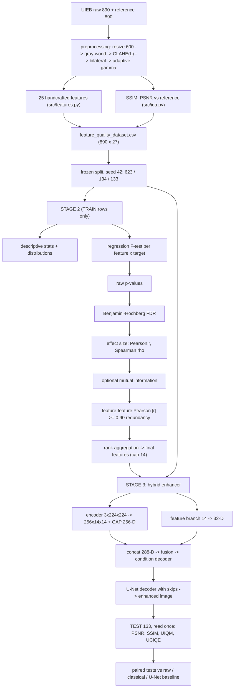

# Stage 2 (statistical feature selection) + Stage 3 (one hybrid enhancement CNN) — implementation plan

*Written 2026-09-27. This is a **plan, not a result**. It contains no p-values, no
F-statistics, no metric values and no conclusions — those are produced only by
running the code on the training split. Every number quoted about the existing
project was read out of the committed artefacts in this repository.*

**Status: awaiting confirmation.** Sections A–L below are the answer to the
professor's request; code is written only after H, I and the five decisions in
§15 are confirmed.

---

## 0. What already exists here — and what the new direction changes

This repository already implements most of Stage 1 and the *data* half of
Stage 2, with validation gates. The plan re-uses it rather than rebuilding it.

| already in the repo | what it gives us | what the new direction adds |
|---|---|---|
| `src/preprocess.py` — resize 600 px → Gray-World → CLAHE(L) → bilateral → adaptive gamma | the frozen classical pipeline, bit-reproducibly verified | modular wrappers only if the report needs them (see §11) |
| `src/features.py` — the 25 handcrafted descriptors, RGB-uint8 contract | Stage 1, complete, 25/25, no NaN | nothing |
| `scripts/build_feature_dataset.py` → `results/feature/feature_quality_dataset.csv` | one row per image: 25 features **+ SSIM + PSNR** computed against the UIEB reference | nothing (this is the Stage-2 target table) |
| `results/feature/data_split.csv` — group-aware 623 / 134 / 133, seed 42 | the frozen split; **must not be regenerated** | nothing |
| `src/iqa.py` — one SSIM/PSNR definition | single source for full-reference metrics | UIQM + UCIQE (**no-reference**) added in `src/nr_metrics.py` |
| `cnn/unet.py`, `cnn/dataset_pairs.py`, `scripts/evaluate_enhancement.py` | a trained, verified U-Net enhancement **baseline** (SSIM 0.8003 / PSNR 19.324 dB on the sealed test split) and its paired-test machinery | the **one hybrid** model is compared against it |
| `results/cnn/*`, `results/comparison/*` | four quality-prediction models + A/B/C/D ablation, already trained and verified | **kept as existing, completed work** — not deleted, not retrained (see §12, risk L10) |
| `src/metrics.py` — `bootstrap_r2_ci`, `bootstrap_mean_delta_ci`, `paired_wilcoxon` | CI + paired-test helpers | reused verbatim for Stage-3 evaluation |

**The change of direction in one sentence.** The thesis so far answers *"how good
is the classical pipeline's output?"* by regression. The new Stage 3 answers
*"can one hybrid network produce a better enhanced image?"* — enhancement, not
prediction — and Stage 2 becomes a **statistical** justification of the 14
features instead of an RF-permutation ranking.

**Two runs, two meanings of "SSIM/PSNR" — never conflate them:**

| | Stage 2 (feature selection) | Stage 3 (enhancement) |
|---|---|---|
| what SSIM/PSNR are | the **target values** (labels) of the classical pipeline's output vs the reference — already computed in `feature_quality_dataset.csv` (890 rows) | **evaluation metrics** of the hybrid's output vs the reference — computed after inference |
| who uses them | the statistical tests (train rows only) | the reported results (test rows only) |
| what is compared | 25 features ↔ those targets | raw vs classical vs U-Net vs hybrid |

---

## A. The recommended statistical-test pipeline (and the verdict for each test)

Targets are **continuous** (SSIM ∈ ~[0,1], PSNR in dB). That decides almost
everything: tests built for categorical outcomes are out; the linear-model
F-test and rank correlations are in.

| # | test / method | stage | appropriate for continuous SSIM/PSNR? | role in our selection |
|---|---|---|---|---|
| 1 | **Univariate regression F-test** (`sklearn.feature_selection.f_regression`) | primary | **yes** — it *is* a regression test for a continuous response | every one of the 25 features gets an F and a p, per target |
| 2 | **Pearson r** (+ its p) | effect size | yes (linear association) | strength of the linear association; **note: its p is the same test as (1)** — not independent evidence |
| 3 | **Spearman ρ** (+ its p) | robustness | yes (monotone association, no linearity/normality requirement) | catches monotone-but-nonlinear relations Pearson misses |
| 4 | **Benjamini–Hochberg FDR** | correction | applies to any p | turns 25 raw p-values into adjusted p-values within each target family |
| 5 | **Pearson |r| ≥ 0.90 on feature–feature pairs** | redundancy | not a test — a screening rule | removes duplicate information *between features* |
| 6 | **Mutual information** (optional) | complementary | yes (any dependence) | non-linear screening **without** a p-value; never labelled significant |
| 7 | **Shapiro–Wilk + QQ plots + skew/kurtosis** | descriptive only | yes | characterises distributions; **not** a gate (§L4) |
| 8 | **paired t-test / Wilcoxon signed-rank** | Stage 3 evaluation | yes — on *paired per-image metric differences* | compares methods (raw vs classical vs U-Net vs hybrid) on the same images — this is the scientifically correct home for the t-test (§C) |

## B. H0 / H1, stated exactly, for every test we do use

**B1. Univariate regression F-test (primary, one per feature per target, 25 × 2 = 50 tests)**

The model under test is the simple linear regression `target = β0 + β1 · feature + ε`.

* **H0:** β1 = 0 — the feature has **no linear relationship** with the target.
* **H1:** β1 ≠ 0 — the feature has a non-zero linear relationship with the target.
* **Data required:** one feature column and one target column, **train rows only** (n = 623).
* **Assumptions:** independent observations; a linear relationship under H1; errors with constant variance; the p-value is exact under normal errors and approximately valid otherwise by the CLT at n = 623. (Features are *not* required to be normal — that is a common misconception.)
* **Test statistic:** F = (explained variance)/(residual variance) for the one-predictor model, with 1 and n−2 degrees of freedom; equivalently F = t² of the slope test.
* **p-value:** P(F ≥ F_obs | H0 true).
* **Significance level:** α = 0.05 raw, **and** BH-adjusted p < 0.05 (§E).
* **How it influences selection:** pass/fail the *significance gate* only. It does **not** rank features by importance — with n = 623 that gate is weak by construction (§E).
* **Terminology:** the F-test here is the same F-test that ANOVA uses for a single continuous predictor; it is *not* a categorical ANOVA. Call it a **regression F-test**.

**B2. Pearson correlation r (effect size, same H0 family as B1)**

* **H0:** ρ = 0 (no linear association in the population). **H1:** ρ ≠ 0.
* **Data:** the same train columns. **Assumptions:** approximate bivariate normality for the exact p; linearity; no extreme outliers driving r (we check with Spearman + scatter).
* **Statistic:** r; **p-value:** from t = r·√((n−2)/(1−r²)).
* **Use:** reported as the **effect size** that accompanies B1. In the univariate case its p-value equals B1's p-value — we report both for completeness but **do not treat them as two independent tests**.

**B3. Spearman rank correlation ρ (robustness)**

* **H0:** the feature and target are **independent in rank order** (ρ_s = 0). **H1:** ρ_s ≠ 0.
* **Data:** same columns; **assumptions:** none beyond independent observations; monotone (not necessarily linear) alternative.
* **Statistic:** ρ_s; **p-value:** permutation/asymptotic approximation used by `scipy.stats.spearmanr`.
* **Use:** if Pearson says "strong" but Spearman says "weak", a few outliers are driving it; we report both and prefer the conservative reading. Spearman also flags the algebraic duplicates Pearson misses (`variance` = `std²`).

**B4. Shapiro–Wilk (descriptive)**

* **H0:** the sample is drawn from a normal distribution. **H1:** it is not.
* **Data:** each feature (and each target), train rows.
* **Use:** reported in the descriptive table with QQ plots and skew/kurtosis. **Not used as a gate and not used for selection** — regression/feature selection does not require normal predictors, and at n = 623 Shapiro rejects trivial deviations.

**B5. Benjamini–Hochberg (correction, not a test)**

For the m = 25 raw p-values of one target: sort p₍₁₎ ≤ … ≤ p₍₂₅₎, then
p_adj(i) = min over k ≥ i of ( m · p₍k₎ / k ), capped at 1.

* **What it controls:** the **expected proportion of false discoveries among the
  features declared significant** (FDR), at 0.05.
* **Why not Bonferroni:** Bonferroni controls the chance of *any* false positive
  (FWER); at m = 25 it multiplies every p by 25, discarding genuinely
  informative features. Bonferroni is computed **as a sensitivity line only**
  and is reported as a secondary column.
* **Nuance worth stating in the viva:** BH's guarantee holds under independence
  and also under positive dependence (PRDS). Our 25 features are correlated but
  in a positively-dependent block structure, so BH applies; we still report the
  redundant pairs explicitly (§D step 6) rather than pretending the tests are
  independent.
* **What an adjusted p-value is NOT:** it is not the probability that the
  feature is unimportant, and 1 − p_adj is not an importance score.

**B6. Mutual information (optional, no p-value)**

* Estimates I(feature; target) in nats/bits — dependence of any form.
* **Use:** complementary evidence in the ranking table, clearly labelled
  "non-significant by construction". MI is not tested; no threshold is applied;
  it never promotes a feature that failed the BH gate.

**B7. Redundancy screening (feature ↔ feature only)**

* **H0/H1 do not apply** — this is a *rule*, not a test: for every pair with
  |Pearson r| ≥ 0.90 (computed on **train only**), the lower-ranked feature is
  dropped, consistent with the existing project rule. A **Spearman ≥ 0.90**
  sensitivity pass is reported separately, because Pearson cannot see exact
  nonlinear duplicates (`variance` = `std²`, `ASM` = `energy²`).
* This is a *different* relationship from §B1–B3: those test feature ↔ target;
  this removes feature ↔ feature duplication.

**B8. Paired t-test / Wilcoxon signed-rank (Stage 3 evaluation only)**

* **H0:** the mean paired difference between two systems' per-image metrics is 0. **H1:** it is not 0.
* **Data:** the same 133 test images scored by both systems (paired by image).
* **Use:** raw vs classical vs U-Net vs hybrid, on SSIM / PSNR / UIQM / UCIQE,
  with bootstrap 95% CIs (`src/metrics.py` already implements these).
* **This is a legitimate t-test use** — one of the professor's asks, in its
  correct place: comparing two methods on the same images. Wilcoxon is reported
  alongside because per-image metric differences are not guaranteed normal.

## C. Tests that are NOT appropriate for our feature selection (and why)

| test | why it does **not** belong in Stage 2 |
|---|---|
| **t-test / Welch t-test on features** | it compares **means of two groups**. SSIM/PSNR are continuous with no scientifically defensible cut-point. Inventing a "high vs low quality" threshold would be dichotomising a continuous variable — it discards information, inflates the false-positive rate, and the result would depend on the invented threshold. **Decision: t-test was considered and not used as the primary feature-selection test**, because the targets are continuous and no pre-registered two-group outcome exists. |
| **One-way ANOVA (categorical factor)** | needs a categorical *factor* (3+ groups). Our predictors are continuous measurements, so there is no factor. The *F-test* still appears — as the regression F-test of B1, which is the same statistic applied to a continuous predictor. Saying "we ran ANOVA" would be a misnomer. |
| **χ² test** | tests association between two *categorical* variables. Both sides here are continuous. |
| **Mann–Whitney U / Kruskal–Wallis** | non-parametric versions of the *two-group* / *multi-group* comparisons above; same objection. (Their legitimate role is Stage-3 method comparison, where groups = methods.) |
| **Kolmogorov–Smirnov for selection** | tests distributional equality between two samples, not association with a continuous target. |
| **Bonferroni as the primary correction** | valid but needlessly conservative at m = 25 (§E). Reported as a sensitivity column only. |
| **Shapiro–Wilk as a gate** | would wrongly discard moderately skewed but informative features; regression does not require normal predictors. |
| **PCA-based selection** | produces linear combinations, not interpretable features — contradicting the project's stated goal of an interpretable 14. |
| **RF permutation importance as primary** | already exists in the repo (`ranking_combined.csv`). It is a model-based heuristic, not a hypothesis test, and its stability depends on the forest. It is **retained for the OLD-vs-NEW comparison** (§D step 8), never as the significance evidence. |
| **Mutual information with a "significance" claim** | MI has no null distribution here; calling it significant would be fabricated rigour. |

## D. The complete 25 → 14 selection methodology

Run on **train rows only (n = 623)**; the test split is opened once, at the end,
by the Stage-3 evaluation. Nothing in steps 1–7 reads `split == "test"`.

| step | what happens | artefact |
|---|---|---|
| 0 | **Data cleaning** — count missing/infinite/constant columns; verify 890 rows × 27 usable columns; nothing imputed silently | report section, `statistical_report.csv` `reason` column |
| 1 | **Descriptive statistics** on train: mean, median, sd, variance, min, max, IQR — for all 25 features **and** for SSIM and PSNR | `results/statistics/descriptive_statistics.csv` |
| 2 | **Distribution diagnostics**: skewness, kurtosis, Shapiro–Wilk W and p, outlier counts (IQR rule), QQ plots | `descriptive_statistics.csv`, `plots/stat_distributions.png` |
| 3 | **Regression F-test** per feature per target (model `target ~ feature`) | `feature_ssim_statistics.csv`, `feature_psnr_statistics.csv` |
| 4 | **Effect size**: Pearson r (+p) and Spearman ρ (+p) per feature per target, with scatter panels | same files, `plots/stat_scatter_ssim.png`, `…_psnr.png` |
| 5 | **BH-FDR** within each target's family of 25 (Bonferroni as a sensitivity column) | `adjusted_p`, `significant` columns |
| 6 | **Redundancy**: 25×25 Pearson matrix on train, |r| ≥ 0.90 pairs, greedy removal in rank order; Spearman sensitivity pass | `correlation_matrix.csv/.png`, `redundancy_pairs.csv` |
| 7 | **(Optional) mutual information** per feature per target, for the ranking table only | `mi` column |
| 8 | **Rank aggregation** (documented, no invented weights — §D-2) → final ordering; **cap at 14**; compare against the OLD 14 | `final_selected_features.csv`, `statistical_report.csv` |
| 9 | **Write the report**: one row per (feature, target) with the professor's requested columns: `feature, target, test, statistic, raw_p, adjusted_p, effect_size, significant, selected, reason` | `statistical_report.csv` + `docs/statistical-findings.md` (generated from the CSV, not hand-written) |

**D-1. The significance gate is a filter, not the selection.** With n = 623, the
two-sided α = 0.05 significance threshold corresponds to roughly **|r| ≈ 0.08**
(computed from the t-distribution, df = 621; BH raises it slightly). In other
words, a feature can be "statistically significant" while explaining well under
1 % of the target's variance. Therefore:

* **p-values decide eligibility** (which features have defensible evidence of association),
* **effect sizes decide ordering** (which eligible features carry the most information),
* **redundancy decides the final cuts** (which eligible, strong features are duplicates),
* and the report **states this hierarchy explicitly** so no reader mistakes a small p for a strong relationship.

**D-2. The composite ranking rule (rank aggregation, no arbitrary weights).**
For each target, each feature receives a rank on each criterion (1 = best):

1. adjusted p-value (ascending — most evidence first),
2. |Pearson r| (descending),
3. |Spearman ρ| (descending),
4. optional |MI| (descending, only if MI is enabled).

Ties receive the **average rank**. The composite score is the **arithmetic mean
of the available criterion ranks** (a Borda-style aggregation). No criterion is
weighted; if MI is disabled it is excluded from the mean and the table says so.
The two targets' composite ranks are then combined by taking the **better
(smaller) rank of the two**, so a feature that is strongly informative for
either SSIM or PSNR is not discarded merely for being weak on the other — this
rule is fixed here, before any numbers are seen, precisely so it cannot be
tuned after looking at results.

**D-3. The 14 cap.** If more than 14 features pass and survive redundancy, the
top 14 by the composite rule are kept and the rest are reported with
`selected = False, reason = "ranked below the 14-feature cap"`. If **fewer than
14** survive, the pipeline returns **the number that survives** and the report
says so; the cap is never met by relabelling a non-significant feature as
significant. (The cap is a project specification, not a statistical finding, and
the report will phrase it that way.)

**D-4. OLD 14 vs NEW 14 — the required comparison.** The old list came from RF
permutation importance + Pearson redundancy, selected on train with the k-sweep
scored on validation:

`red_ratio, dynamic_range, entropy, correlation, keypoint_density, homogeneity,
mean_blue, mean_value, mean, dissimilarity, laplacian_variance, glcm_variance,
mean_saturation, variance`

The report will show a side-by-side table — in / out / in both — and attribute
each difference to one of exactly three causes: (a) failed the BH gate,
(b) lost the redundancy cut, (c) ranked below the cap. "It changed because the
method changed" is not an explanation; the reason column is mandatory.

## E. Multiple-testing strategy (summary)

* m = 25 tests per target (SSIM family, PSNR family). Applying BH **within each
  target** is the primary correction. A second, stricter family (all 50 tests
  together) is reported as a sensitivity line so the reader can see whether the
  conclusion depends on the family definition.
* Report for every feature: raw p, BH-adjusted p, Bonferroni-adjusted p,
  significant (BH < 0.05) y/n, and the effect size.
* **Why correction is necessary:** without it, running 25 tests at α = 0.05 means
  ~1.25 false positives are expected per target *even if every feature were
  pure noise* (25 × 0.05 = 1.25). The report states this arithmetic — it is the
  cleanest justification available and needs no result.
* **What we will not say:** that an adjusted p-value proves or disproves a
  hypothesis, or that it measures importance.

## F. Hybrid CNN — the ONE model, resolved against the existing architecture

The professor's diagram has a dimensional tension worth naming up front: a
**Global Average Pooling** head produces the 256-D embedding needed for fusion
but **destroys the spatial grid the decoder needs**. The resolution:

```
                     underwater image (letterboxed 3×224×224)
                                  │
        ┌─────────────────────────┴──────────────────────────┐
        │  ENCODER (4 blocks, each: Conv3×3 → BN → ReLU → MaxPool2)
        │  b1: 3→32    224→112     ──────────────── skip s1 (32×112×112)
        │  b2: 32→64   112→56      ──────────────── skip s2 (64×56×56)
        │  b3: 64→128  56→28       ──────────────── skip s3 (128×28×28)
        │  b4: 128→256 28→14       ─── spatial bottleneck z4 (256×14×14)
        └─────────────────────────┬──────────────────────────┘
                                  │
                    Global Average Pooling  →  256-D image embedding
                                  │
14 selected features → StandardScaler(train) → Linear(14→32) → ReLU → Dropout → 32-D
                                  │
                       CONCATENATE  →  288-D fused vector
                                  │
             Fusion:  Linear(288→256) → ReLU     (the "fusion layer")
                                  │
        ┌─────────────────────────┴──────────────────────────┐
        │  CONDITIONING:  z4 (256×14×14) ⊕ broadcast(fused 256) 
        │  (+ optional FiLM scale/shift per decoder level)
        └─────────────────────────┬──────────────────────────┘
                                  │
              DECODER (4 upsample stages, U-Net-style skips)
              14→28  concat s3 (128ch) → Conv-BN-ReLU → 128
              28→56  concat s2 ( 64ch) → Conv-BN-ReLU →  64
              56→112 concat s1 ( 32ch) → Conv-BN-ReLU →  32
              112→224                   Conv-BN-ReLU →  16 → Conv1×1 → 3,  Sigmoid
                                  │
                          enhanced image 3×224×224
                                  │
                  un-letterbox → resize to the preprocessed (H, W)
                                  │
     metrics vs UIEB reference: PSNR, SSIM (full-reference) + UIQM, UCIQE (no-reference)
```

Design decisions and why:

* **Both branch outputs come from block 4** — the 256-D GAP vector serves the
  fusion, while the 256×14×14 map serves the decoder. Nothing is lost and no
  extra encoder is needed.
* **The 14 features condition the decoder** through the fused vector (added at
  the bottleneck and optionally per level), which is exactly the professor's
  "condition or initialize the enhancement decoder" requirement — they do not
  merely feed a side head.
* **Skip connections** are the reason colour cast / haze (low-frequency, deep
  path) and detail (high-frequency, skips) can both be reconstructed.
* **Sigmoid output** bounds the image to [0,1]; the target is the aligned UIEB
  reference in [0,1].
* **No pretrained weights** — consistent with the existing project, so any gain
  is attributable to the features + data, not to ImageNet priors.

## G. Enhancement training protocol and loss

* **Loss (configurable, no invented provenance):**
  `L_total = λ_L1 · L1(output, target) + λ_SSIM · (1 − SSIM(output, target))`,
  with `λ_L1 = 1.0, λ_SSIM = 0.0` as the *stated default* (pure L1, matching the
  existing verified U-Net), and λ_SSIM > 0 offered as a **project choice**
  (e.g. 0.1, 0.5) reported as an ablation. The code and the thesis must say
  "chosen by us", never "taken from paper X".
  A **differentiable** SSIM is required for the loss — `skimage` is not
  differentiable; a small from-scratch SSIM implemented with average pooling is
  used for the loss, while the *reported* SSIM stays `src/iqa.py` (frozen,
  non-differentiable, identical to every other number in the repo). The two are
  cross-checked to agree to ~1e-10.
* **Data:** train split only (623 pairs); val (134) for early stopping;
  augmentation = the existing paired geometric set (flips × rot90 = 8, identical
  on input and target). Same resize/letterbox treatment for input and target.
* **Optimiser:** Adam, LR ×1e-3 with a documented schedule; early stopping on
  **validation SSIM** (full-resolution), best checkpoint kept — the same
  protocol the existing U-Net used, so the comparison is fair.
* **Loss resolution vs metric resolution:** L1 is computed at 224 (letterboxed)
  for speed; **all reported metrics are computed at the original resolution**
  through the frozen `src/iqa.py` definition, after un-letterboxing the output.
  The identical resize-back step is applied to *every* system being compared
  (raw, classical, U-Net, hybrid) so no method gets a resampling advantage.
* **Multiple seeds:** at least 3 (42/43/44) with the existing `_s<seed>` tag
  convention, because a single run on 133 test images cannot separate models.

## H. Exact data flow

```
STAGE 1  (exists)   raw 890 ─► src/preprocess ─► dataset/preprocessed/*
                             ─► src/features    ─► 25 descriptors
STAGE 2  (new)      results/feature/feature_quality_dataset.csv  (25 + SSIM + PSNR)
                    + results/feature/data_split.csv
                       └─ TRAIN rows only (623) ──► statistics pipeline (§D)
                             └─ results/statistics/*.csv + 10 plots
                             └─ final_selected_features.csv        (the NEW 14)
STAGE 3  (new)      TRAIN 623 + VAL 134 ──► hybrid enhancer (§F) ──► checkpoint
                    TEST 133 (read once) ──► enhanced PNGs
                             └─ metrics vs reference: PSNR, SSIM, UIQM, UCIQE
                             └─ paired tests vs raw / classical / U-Net
                             └─ results/hybrid/* + plots/hybrid_*.png
```

**Leakage firewall for the new stages**

| stage | train | val | test | reference image |
|---|---|---|---|---|
| descriptive stats, F-tests, BH, MI, redundancy, ranking | ✔ only | ✘ | ✘ | ✔ (already baked into the labels) |
| scaler (14 features) | ✔ fit | ✘ | ✘ | ✘ |
| hybrid training | ✔ | ✔ early stop | ✘ | ✔ as the *target* only |
| evaluation | ✘ | ✘ | ✔ once | ✔ to compute the metrics |

## I. Exact tensor dimensions

| stage | tensor | dims |
|---|---|---|
| input image | letterboxed RGB | 3 × 224 × 224 |
| encoder b1 → b4 | feature maps | 32×112×112 → 64×56×56 → 128×28×28 → **256×14×14** |
| image embedding | GAP of b4 | **256** |
| input features | 14 selected (train-fitted scaler) | **14** |
| feature branch | Linear(14→32) → ReLU → Dropout | **32** |
| fusion input | concat | **288** |
| fusion layer | Linear(288→256) → ReLU | **256** |
| conditioning | broadcast-add to b4 | 256×14×14 |
| decoder up 1 | upsample 14→28, concat s3 (128) → conv | 128×28×28 |
| decoder up 2 | upsample 28→56, concat s2 (64) → conv | 64×56×56 |
| decoder up 3 | upsample 56→112, concat s1 (32) → conv | 32×112×112 |
| decoder up 4 | upsample 112→224 → conv → Conv1×1 → Sigmoid | **3×224×224** |
| un-letterbox | crop bars, resize to preprocessed size | 3 × H × W (H ∈ 266–901, W = 600) |
| output | enhanced image, uint8, written as PNG | 3 × H × W |

Parameter count will be reported by `count_params()` and recorded in the
checkpoint — no estimate is quoted here.

## J. Monday deliverables — mapped to reality

| # | deliverable | where it comes from | feasible by Monday? |
|---|---|---|---|
| 1 | complete flowchart | §H + the mermaid diagram at the end of this file | ✔ already here |
| 2 | table of all 25 features | `docs/exact-flow.md` §3 + `src/features.py` docstrings | ✔ exists |
| 3 | descriptive statistics | step 1 of §D | ✔ fast (one CPU-minute) |
| 4–5 | hypothesis-testing methodology, H0/H1 | §A, §B, §C | ✔ already in this file |
| 6–8 | F-statistics, raw p, adjusted p | step 3–5 | ✔ fast — but only after you confirm the plan |
| 9 | Pearson/Spearman association | step 4 | ✔ fast |
| 10–11 | correlation matrix, redundant pairs | step 6 | ✔ fast |
| 12 | final selected 14 | step 8 | ✔ fast |
| 13–14 | hybrid architecture + tensor dimensions | §F, §I | ✔ already here |
| 15 | enhancement flow | §H, §G | ✔ already here |
| 16–19 | PSNR / SSIM / UIQM / UCIQE of the hybrid | requires the trained hybrid | ⚠ **not by Monday** — see below |
| 20 | qualitative before/after | requires the trained hybrid | ⚠ same |

**The honest constraint on 16–20.** The existing U-Net needed ≈124 min of CPU
(2 cores) for 75 epochs at 128×128 crops. A 224×224 hybrid with a decoder is
several times heavier per epoch, and this sandbox suspends between messages.
Options, in order of preference:

1. **Split the Monday story:** Stage 2 fully finished with real numbers +
   architecture + tensor table + a **smoke-tested** model (overfit 8 images to
   prove the code runs, dimensions match, and gradients flow), with 16–19 clearly
   labelled *preliminary, not final*. This is defensible and honest.
2. Train the hybrid on a **GPU** (Colab/Kaggle) — I can prepare the exact
   commands and a self-contained config for that.
3. Train here at reduced resolution on a subset for a same-day preliminary
   number — clearly labelled, and **not** presented as the final result.

## K. Folder structure — mapped onto this repository

A second `project/` tree beside the existing one would create two sources of
truth for the split, the features and the metrics. The requested structure is
therefore mapped into the existing layout:

```
UIE-fyp/
├── src/                      (exists)  config.py · preprocess.py · features.py · iqa.py · metrics.py
│   └── nr_metrics.py         (new)     UIQM + UCIQE, from the published definitions, cited
├── statistics/               (new)     __init__.py · descriptive.py · hypothesis_tests.py ·
│                                        multiple_testing.py · correlation.py · selector.py
├── cnn/                      (exists)  model.py · dataset.py · unet.py · dataset_pairs.py · train*.py
│   └── hybrid.py             (new)     cnn_encoder.py / feature_branch.py / fusion.py /
│                                        decoder.py / hybrid_enhancer.py (as classes in this package)
├── scripts/
│   ├── run_statistics.py     (new)     the whole §D pipeline → results/statistics/*
│   ├── train_hybrid.py       (new)     Stage-3 training
│   ├── evaluate_hybrid.py    (new)     PSNR/SSIM/UIQM/UCIQE + paired tests
│   ├── make_stat_plots.py    (new)     the 10 required visualisations
│   └── verify_hybrid.py      (new)     the same independent-verification pattern as the U-Net
├── results/statistics/       (new)     the professor's required CSVs
├── results/hybrid/           (new)     metrics.json · per-image CSV · train history
├── checkpoints/                        (models/, already gitignored — kept as-is)
└── docs/                               this plan + generated findings + viva pack
```

Deliberate deviations from the professor's sketch, each with a reason:

* `config.yaml` → **not added.** `src/config.py` is the single source of truth
  that every existing script imports; a second config file would eventually
  disagree with it. If a YAML is wanted for the report, it is **generated from**
  `src/config.py`, never edited by hand.
* `preprocessing/gray_world.py` etc. → the functions already exist as modular
  functions in `src/preprocess.py` and that file is **frozen and bit-reproducibly
  verified**; splitting it into five files changes no behaviour and invalidates
  the file-level verification chain for no scientific gain. Thin wrapper modules
  can be added if the professor requires the folder names.
* `metrics/psnr.py`, `ssim.py` → already one frozen module (`src/iqa.py`) with an
  independent from-scratch cross-check; UIQM/UCIQE join it in `src/nr_metrics.py`
  so there is exactly one definition per metric in the whole project.

## L. Risks and statistical mistakes to avoid

| # | risk | mitigation |
|---|---|---|
| L1 | **Misreading p-values** — "p = 0.03 means 3 % chance H0 is true" / "97 % important" | fixed language in §B; the report template only ever says "reject / fail to reject H0 at α" and always prints the effect size next to the p |
| L2 | **Significance without importance** — with n = 623 almost everything may pass the gate | the three-tier hierarchy in §D-1; effect size + redundancy drive the ranking |
| L3 | **Multiple testing** — ~1.25 false positives expected per target at α = 0.05 with 25 tests | BH-FDR primary; Bonferroni + 50-test family as sensitivity |
| L4 | **Over-testing normality** | Shapiro/QQ are descriptive only; no test gates selection on normality |
| L5 | **Feature–target vs feature–feature confusion** | two separate report columns and two separate sections; the redundancy rule never uses target information |
| L6 | **Leakage** | §H firewall; the statistics pipeline physically reads only `split == "train"` rows; the test set is opened once, by the evaluator |
| L7 | **Dropping the frozen split or features** | `data_split.csv`, `feature_quality_dataset.csv`, `src/preprocess.py` and `src/features.py` are treated as frozen inputs; a diff check runs before and after the statistics stage |
| L8 | **Incomparable metrics** | one definition per metric (`src/iqa.py`, `src/nr_metrics.py`); the same resize-back protocol for every compared system; UIQM/UCIQE numbers are **never** compared with published numbers from other papers, because implementations differ |
| L9 | **UIQM/UCIQE misread as ground truth** | they are no-reference proxies that reward saturation/contrast and can rise while SSIM falls. Reported alongside SSIM/PSNR, never instead of them; the tension is discussed if it appears |
| L10 | **Scope creep / destroying completed work** | the four quality-prediction models stay as existing, verified, already-reported work (they belong to the previous framing and to the optional no-reference branch); Stage 3 adds **one** model. Nothing already committed is deleted or retrained |
| L11 | **"14 by fiat"** | §D-3: the cap is a specification, reported as such; fewer than 14 is reported as the honest outcome |
| L12 | **Resolution mismatch in the comparison** | the hybrid works at 224 and upsamples back, while the existing U-Net outputs full resolution. This is a built-in disadvantage for the hybrid; it is stated in the results, and the U-Net is labelled a *baseline*, not a rival |
| L13 | **Stage-2 label semantics** | the statistical targets are the *classical pipeline's* similarity to the reference. That is the honest definition of what the features are being tested against; whether the same 14 help an *enhancement decoder* is a separate empirical question answered by ablation A vs B, not assumed |
| L14 | **Fabricated provenance for loss weights / UIQM constants** | λ values and metric constants are either taken from a cited source or labelled a project choice, in code and in the thesis |

---

## 15. Five decisions needed before code is written

1. **Stage-2 targets** — keep the classical-pipeline SSIM/PSNR labels in
   `feature_quality_dataset.csv` as the statistical targets (recommended, they
   exist and are frozen), or define something else?
2. **BH family** — BH within each target's 25 tests as primary (recommended),
   with the combined 50-test family reported as sensitivity.
3. **The 14 cap** — rank-aggregation to exactly 14 when more survive
   (recommended, since the project spec says 14), with the honest count reported
   if fewer survive.
4. **Stage-3 compute** — smoke-test + preliminary here, full training on a GPU
   (recommended), or reduced-resolution training here?
5. **Existing four prediction models** — keep them as completed prior work
   (recommended), or retire them from the thesis narrative?

## Viva answers (30 questions)

To be generated **after** the statistics actually run, so that Q21 ("why select
14 features?"), Q22 ("why not all 25?") and Q30 ("what is the contribution?")
can cite our real adjusted p-values, effect sizes and surviving count instead of
invented ones. The methodology questions (Q1–Q20, Q23–Q29) are answerable from
§A–§G today and will be written up in the same document, beginner-friendly and
technically correct, with no numbers attached to results we do not have.

## Flowchart (Monday deliverable 1)


